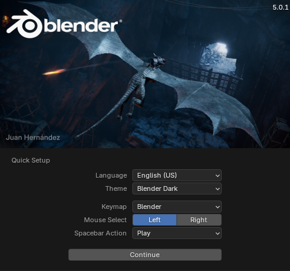
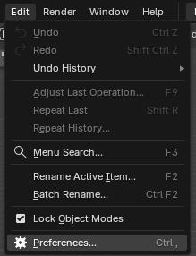
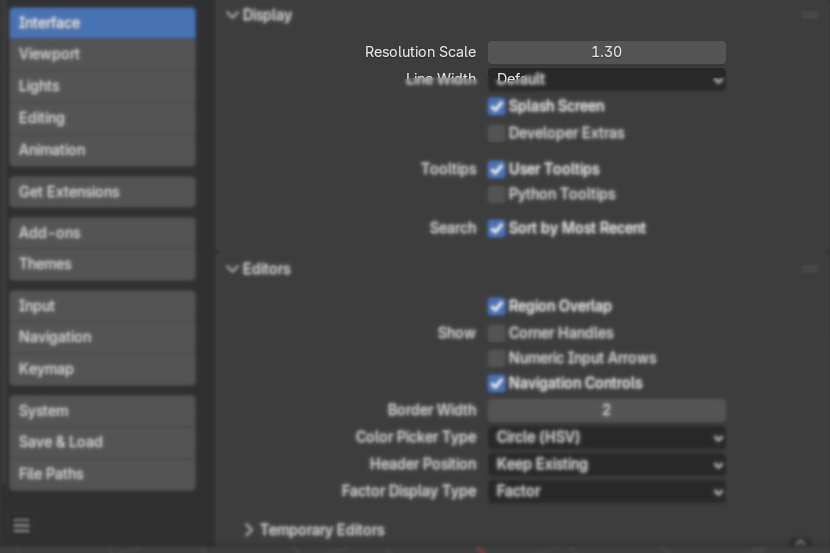
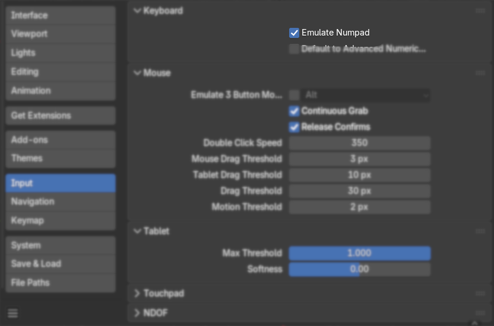
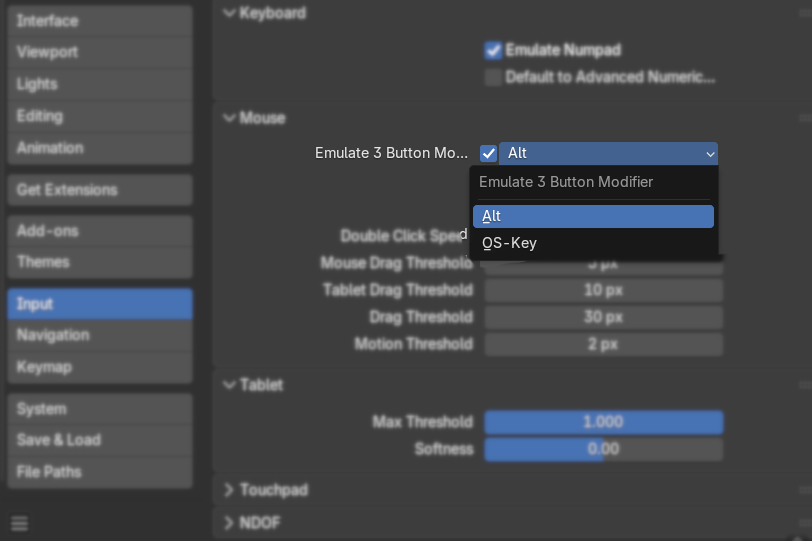

## Introduction :


Blender 3D

**Blender** 3D is a [free and open-source](https://en.wikipedia.org/wiki/Free_and_open-source_software "Free and open-source software") [3D computer graphics](https://en.wikipedia.org/wiki/3D_computer_graphics "3D computer graphics") software tool set that runs on [Windows](https://en.wikipedia.org/wiki/Windows "Windows"), [macOS](https://en.wikipedia.org/wiki/MacOS "MacOS"), [Linux](https://en.wikipedia.org/wiki/Linux "Linux"), [BSD](https://en.wikipedia.org/wiki/BSD "BSD"), [Haiku](https://en.wikipedia.org/wiki/Haiku_\(operating_system\) "Haiku (operating system)"), and [IRIX](https://en.wikipedia.org/wiki/IRIX "IRIX"). It is used for creating [animated films](https://en.wikipedia.org/wiki/Animated_films "Animated films"), visual effects, art, [3D-printed](https://en.wikipedia.org/wiki/3D_printing "3D printing") models, [motion graphics](https://en.wikipedia.org/wiki/Motion_graphics "Motion graphics"), interactive 3D applications, and [virtual reality](https://en.wikipedia.org/wiki/Virtual_reality "Virtual reality"). It is also used in creating models for video games.

Below are things you can do with blender:
- 3D Modeling (making objects)
- Sculpting (clay-style shaping)
- Animation (movement)
- Materials & Texturing (surface details)
- Lighting & Rendering (final image/video output)
- VFX & Compositing
## Installation

Go on Official [Blender 3D](https://www.blender.org/) Website.

head towards download page

You also check out Old Releases or Experimetal Builds.

It will Auto-detect which OS system you are using.

On Windows :

Download Windows Installer, Run the installer, Install it & After installation Open it.

OR

Use Portable One (No installation need), Extract Zip and Directly RUN `blender-3d-launcher.exe`.

It will Open Blender 3D.

On Linux :

Download Linux tarball file extract and run directly 

```bash
# Heading into Downloads Directory
cd ~/Downloads

# Extracting taball file.
# tar -xvf blender-x.x.x-linux-x64.tar.xz 
tar -xvf blender-5.0.1-linux-x64.tar.xz

# Run Blender 3DApplication
./blender-launcher
```

**Extra**

Gnome Desktop Setup

```
sudo cp -r ~/Downloads/blender-5.0.1-linux-x64 /opt/

sudo cp -r /opt/blender/blender.desktop ~/.local/share/applications/
nano ~/.local/share/applications/blender.desktop
```

**blender.desktop:**
add those 
```desktop
Exec=/opt/blender/blender
Icon=/opt/blender/blender.png
```

change permissions & update :
```
chmod +x ~/.local/share/applications/blender.desktop
update-desktop-database ~/.local/share/applications/ 2>/dev/null
```

then use `super` key and search for `blender`  icon may appear in applications menu.

## Blender 3D

Launch the Blender 3D,  in center a small windows pop-up, every time you open application 
a small windows will appear it called `splash screen`, you quickly set settings here, 



click on out of the splash screen it will disappear,.



Find `Edit`  on top bar, click on `Preferences` or use Shortcuts ***CTRL+,***



In preferences, adjust Resolution Scale as per your requirement (1.30)
settings will be set as AutoSaved by default, so close the windows, settings apply quickly.




Turn ON `Emulate Numpad`.
Main Numbers keys acts as Numpad keys (usefull for laptops).



Also Turn ON 3 Button Mouse.

in absence of scroll wheel on mouse, use `Alt` key  OR `Super` (as per settings) key for same thing.

## Hot-Key / Short-Cut

`CTRL+,`:  Open Preferences Tab

## Reference

[Blender  Basics : CG Cookies Youtube Channel](https://www.youtube.com/watch?v=6FaLHFJ2kKI)
